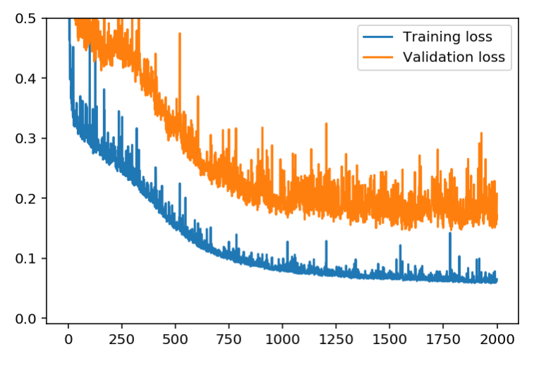
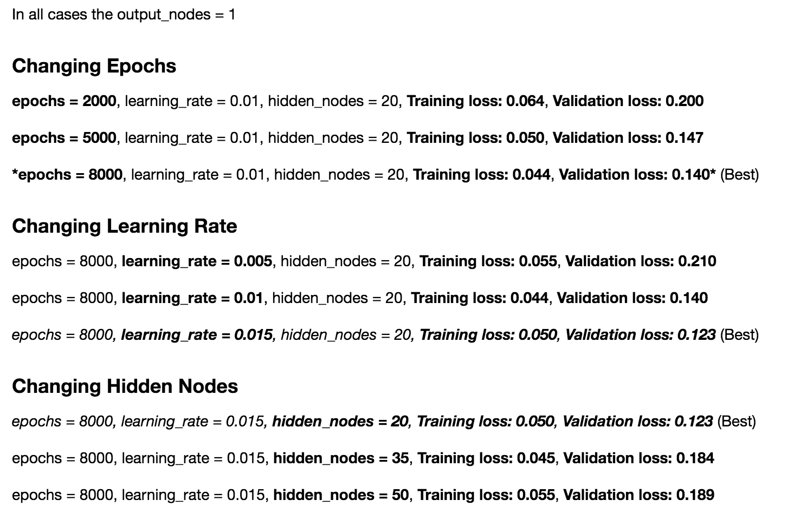
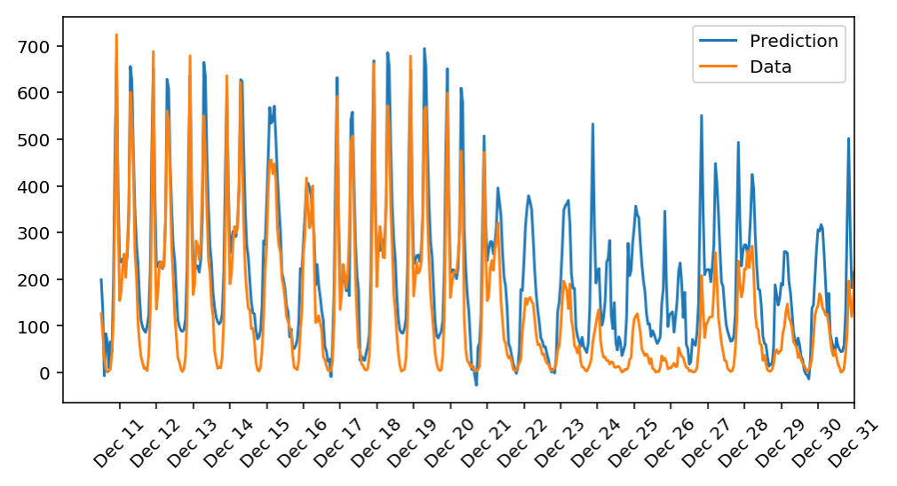

# Daily Bike Rental Neural Network

This is my first neural network as part of the Udacity deep learning course.

## Results

### Training and Validation Loss

### Changing Epochs, Learning Rate, and Hidden Nodes

### Neural Network Prediction vs. Actual Data

## Credit

This project was made possible by the [amazing team at Udacity](https://www.udacity.com/course/deep-learning-nanodegree-foundation--nd101) and inspired by [zhuanxuhit's neural net](https://github.com/zhuanxuhit/dlnd-your-first-neural-network).

## License

[MIT License](LICENSE).
